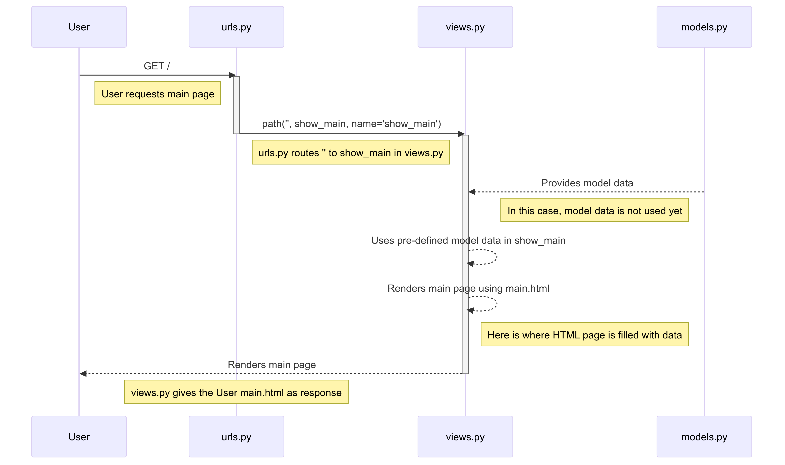

# KickStash

-   [URLs](#URLs)
-   [Pertanyaan dan Jawaban](#Pertanyaan-dan-Jawaban)
    -   [Tugas 4](#Tugas-4--Pertanyaan-dan-Jawaban)
    -   [Tugas 3](#Tugas-3--Pertanyaan-dan-Jawaban)
    -   [Tugas 2](#Tugas-2--Pertanyaan-dan-Jawaban)
-   [Checklist Tugas](#Checklist-Tugas)
    -   [Tugas 4](#Tugas-4--Checklist)
    -   [Tugas 3](#Tugas-3--Checklist)
    -   [Tugas 2](#Tugas-2--Checklist)

## URLs

URL (deployed via PWS):  
http://daffa-abhipraya-kickstash.pbp.cs.ui.ac.id/

## Pertanyaan dan Jawaban

### Tugas 4 — Pertanyaan dan Jawaban

1. Apa perbedaan antara `HttpResponseRedirect()` dan `redirect()`?

    **_Jawab_**:

    Perbedaan antara `HttpResponseRedirect()` dan `redirect()` adalah sebagai berikut.

    a. `HttpResponseRedirect()`:

    - Mengembalikan status kode `302` yang berarti bahwa browser harus melakukan pengalihan ke URL yang diberikan.
    - Penggunaanya:
        ```python
        from django.http import HttpResponseRedirect
        return HttpResponseRedirect('/some/url/')
        ```
    - Memerlukan _absolute path_ atau _full URL_.

    b. `redirect()`:

    - Mengembalikan objek `HttpResponseRedirect` yang sama dengan `HttpResponseRedirect()`.
    - Penggunaanya:
        ```python
        from django.shortcuts import redirect
        return redirect('/some/url/')
        ```
    - Memungkinkan penggunaan _named URL patterns_ dan _relative paths_.
    - Juga memungkinkan untuk _pass_ argumen tambahan seperti `args` dan `kwargs`.

    Dengan kata lain, `redirect()` adalah _shortcut_ dari `HttpResponseRedirect()` yang lebih fleksibel.

2. Jelaskan cara kerja penghubungan model `Product` dengan `User`!

    **_Jawab_**:

    a. **Membuat Relasi**:

    - Membuat relasi antara model `Product` dan `User` dengan menggunakan _foreign key_.
    - Menambahkan atribut `user` pada model `Product` yang merujuk ke model `User`.

    b. **Menghubungkan Data**:

    - Ketika membuat objek `Product`, kita juga menyimpan ID pengguna yang sedang _logged in_ ke atribut `user`.
    - Dengan demikian, kita dapat mengetahui produk mana yang dimiliki oleh pengguna tertentu.

    c. **Menampilkan Data**:

    - Ketika menampilkan data produk, kita hanya menampilkan produk yang dimiliki oleh pengguna yang sedang _logged in_, bukan semua produk yang ada di database.

3. Apa perbedaan antara _authentication_ dan _authorization_, apakah yang dilakukan saat pengguna login? Jelaskan bagaimana Django mengimplementasikan kedua konsep tersebut.

    **_Jawab_**:

    a. **Authentication**:

    - _Authentication_ adalah proses verifikasi identitas pengguna, yaitu memastikan bahwa pengguna adalah siapa yang mereka klaim.
    - Saat pengguna login, Django memeriksa kredensial pengguna (seperti _username_ dan _password_) dan memverifikasi apakah mereka cocok dengan yang ada di database.
    - Django menggunakan _session_ untuk menyimpan informasi _authentication_ pengguna, seperti _user ID_ dan _username_.

    b. **Authorization**:

    - _Authorization_ adalah proses menentukan hak akses pengguna, yaitu apa yang diizinkan pengguna lakukan setelah mereka terautentikasi.
    - Django menggunakan _permissions_ dan _groups_ untuk mengatur hak akses pengguna, seperti siapa yang dapat menambahkan, mengedit, atau menghapus objek tertentu.
    - Saat pengguna login, Django memeriksa _permissions_ dan _groups_ pengguna untuk menentukan apa yang mereka dapat lakukan di aplikasi.

    c. **Implementasi Django**:

    - Django menyediakan _authentication_ dan _authorization_ bawaan melalui `django.contrib.auth`.
    - _Authentication_ diimplementasikan melalui `User` model dan `auth` views, seperti `login`, `logout`, dan `register`.
    - _Authorization_ diimplementasikan melalui _permissions_ dan _groups_ yang dapat ditambahkan ke model dan _views_. Pengguna dapat diberikan hak akses berdasarkan _permissions_ dan _groups_ yang mereka miliki.

4. Bagaimana Django mengingat pengguna yang telah login? Jelaskan kegunaan lain dari _cookies_ dan apakah semua cookies aman digunakan?

    **_Jawab_**:

    a. **Django Session Framework**:

    - Django menggunakan _session_ untuk mengingat pengguna yang telah login.
    - Saat pengguna login, Django membuat _session_ unik untuk pengguna tersebut dan menyimpannya di database.
    - _Session_ ini kemudian digunakan untuk mengidentifikasi pengguna di setiap _request_ yang mereka lakukan.

    b. **Cookies**:

    - _Cookies_ adalah data kecil yang disimpan di _client_ (_browser_) pengguna.
    - _Cookies_ digunakan untuk menyimpan informasi seperti _session key_, preferensi pengguna, dan _last login_.
    - _Session key_ yang digunakan oleh Django disimpan di _cookies_ pengguna untuk mengidentifikasi pengguna yang telah login.

    c. **Keamanan Cookies**:

    - Tidak semua _cookies_ aman digunakan, terutama _cookies_ yang menyimpan informasi sensitif seperti _password_.
    - _Cookies_ yang tidak dienkripsi atau tidak di-_secure_ dapat rentan terhadap serangan

5. Jelaskan bagaimana cara kamu mengimplementasikan _checklist_ di atas secara _step-by-step_ (bukan hanya sekadar mengikuti tutorial).

    **_Jawab_**:

    1. Pertama, saya membuat form register menggunakan `UserCreationForm` dari `django.contrib.auth.forms` di `views.py` aplikasi `main`.

        ```python
        def register(request):
            form = UserCreationForm()

            if request.method == "POST":
                form = UserCreationForm(request.POST)
                if form.is_valid():
                    form.save()
                    messages.success(request, 'Your account has been successfully created!')
                    return redirect('main:login')
            context = {'form':form}
            return render(request, 'register.html', context)
        ```

        Tidak lupa, saya juga membuat page HTML sederhananya untuk form registrasi ini, yaitu `register.html` di dalam direktori `templates/main`.

        ```html
        <form method="POST">
        	
        	<table>
        		{{ form.as_table }}
        		<tr>
        			<td></td>
        			<td>
        				<input
        					type="submit"
        					name="submit"
        					value="Daftar"
        				/>
        			</td>
        		</tr>
        	</table>
        </form>
        ```

        Lalu, saya menambahkan page ini ke `urls.py` di dalam direktori `main` agar dapat diakses di `/register`.

    2. Kedua, saya membuat form login menggunakan `AuthenticationForm` dari `django.contrib.auth.forms` dan method `authenticate` & `login` dari `django.contrib.auth` di `views.py` aplikasi `main`.

        ```python
        def login_user(request):
          if request.method == "POST":
              form = AuthenticationForm(data=request.POST)

              if form.is_valid():
                  user = form.get_user()
                  login(request, user)
                  response = HttpResponseRedirect(reverse("main:show_main"))
                  response.set_cookie('last_login', str(datetime.datetime.now()))
                  return response

          else:
              form = AuthenticationForm(request)
          context = {"form": form}
          return render(request, "login.html", context)
        ```

        Di sini, saya langsung _set_ cookie `last_login` dengan waktu saat ini ketika pengguna berhasil login menggunakan library `datetime`.

        Setelah itu, saya membuat page HTML baru untuk form login ini, yaitu `login.html` di dalam direktori `templates/main`, mirip seperti `register.html`. Bedanya yang paling signifikan adalah adanya link untuk menuju halaman registrasi.

        Saya juga tidak lupa menambahkan page ini ke `urls.py` di dalam direktori `main` agar dapat diakses di `/login`.

    3. Fungsi terakhir yang saya buat adalah logout menggunakan method `logout` dari `django.contrib.auth` di `views.py` aplikasi `main`.

        ```python
        def logout_user(request):
          logout(reqreuest)
          response = HttpResponseRedirect(reverse('main:login'))
          response.delete_cookie('last_login')
          return response
        ```

        Saya langsung menerapkan delete cookie `last_login` ketika pengguna logout.

        Saya juga menambahkan fungsi ini ke `urls.py` di dalam direktori `main` agar dapat diakses di `/logout`.

    4. Untuk langkah-langkah terakhir, saya melakukan beberapa hal:

        - Menambahkan `@login_required(login_url='/login')` di `show_main` agar hanya pengguna yang sudah login yang dapat mengakses halaman utama.
        - Menambahkan 2 _context_ untuk ditampilkan di _main page_:
            ```python
            'last_login': req.COOKIES['last_login'],
            'name': req.user.username,
            ```
        - Menambahkan `last_login` dan `name` ke _main page_ agar dapat ditampilkan.
        - Menambahkan _button_ untuk logout di _main page_ yang mengarahkan ke `/logout`.
        - Mengubah cara mengambil produk di fungsi `show_main` di `views.py` agar hanya mengambil produk milik _user_ yanng sedang login.
            ```python
            products = Product.objects.filter(user=req.user)
            ```

### Tugas 3 — Pertanyaan dan Jawaban

1. Jelaskan mengapa kita memerlukan _data delivery_ dalam pengimplementasian sebuah platform?

    **_Jawab_**:

    Kita perlu _data delivery_ karena beberapa alasan berikut.

    - Memungkinkan platform dalam mengirimkan data dalam bentuk XML atau JSON, sehingga aplikasi klien mudah untuk menggunakan dan mengolah data tersebut.
    - Berguna untuk memisahkan antara _backend_ dan _frontend_ sehingga memungkinkan pengembangan aplikasi yang lebih modular dan terstruktur.
    - Memungkinkan aplikasi untuk berkomunikasi dengan _third-party services_ dan _APIs_ lainnya dengan mudah.
    - Memastikan bahwa hanya data yang diperlukan yang dikirimkan ke aplikasi klien, sehingga mengurangi _overhead_, mempercepat _loading time_, dan melindungi data lainnya.

2. Menurutmu, mana yang lebih baik antara XML dan JSON? Mengapa JSON lebih populer dibandingkan XML?

    **_Jawab_**:

    JSON **lebih baik** daripada XML. Hal ini disebabkan oleh beberapa alasan berikut.

    a. **Ringkas**: JSON lebih ringkas daripada XML, karena hanya membutuhkan sedikit karakter untuk merepresentasikan data yang sama.

    b. **Mudah Di-_parse_**: JSON lebih mudah di-parse oleh bahasa pemrograman modern.

    c. **Mudah Dibaca**: JSON lebih mudah dibaca oleh manusia karena strukturnya yang sederhana.

3. Jelaskan fungsi dari method `is_valid()` pada form Django dan mengapa kita membutuhkan method tersebut?

    **_Jawab_**:

    Method `is_valid()` pada form Django berguna untuk memvalidasi apakah data yang diisikan di form mengikuti aturan yang dibuat di class form yang dibuat, seperti misalnya di kode saya, `ProductForm`. Ini mencakup validasi seperti _required fields_, _data types_, dan lainnya.

4. Mengapa kita membutuhkan `csrf_token` saat membuat form di Django? Apa yang dapat terjadi jika kita tidak menambahkan `csrf_token` pada form Django? Bagaimana hal tersebut dapat dimanfaatkan oleh penyerang?

    **_Jawab_**:

    Kita membutuhkan `csrf_token` saat membuat form di Django untuk melindungi aplikasi dari serangan _Cross-Site Request Forgery_ (CSRF). Jika kita tidak menambahkan `csrf_token` pada form Django, maka penyerang dapat memanfaatkan celah ini untuk melakukan serangan CSRF, di mana penyerang dapat mengirimkan _request_ palsu ke aplikasi yang memanfaatkan _session_ yang sudah ada di _client_.

5. Jelaskan bagaimana cara kamu mengimplementasikan _checklist_ di atas secara _step-by-step_ (bukan hanya sekadar mengikuti tutorial).

    **_Jawab_**:

    1. Pertama, saya membuat file `base.html` di `/templates` berisi block `meta` dan `content` yang akan di-extend atau diisi oleh HTML lainnya.

        ```html
        
        <!DOCTYPE html>
        <html lang="en">
        	<head>
        		<meta charset="UTF-8" />
        		<meta
        			name="viewport"
        			content="width=device-width, initial-scale=1.0"
        		/>
        		 
        	</head>

        	<body>
        		 
        	</body>
        </html>
        ```

        Tidak lupa, saya juga menambahkan base template HTML tersebut ke `TEMPLATES` di `/kickstash/settings.py` agar dikenali oleh Django. Setelah itu, saya me-_refactor_ `main.html` di `/main/templates` untuk meng-extend `base.html`.

        Hal ini guna mempersingkat kode HTML yang akan digunakan di setiap halaman.

    2. Saya membuat form `ProductForm` di `forms.py` yang akan digunakan untuk menambahkan objek dengan model `Product` ke database.

        ```python
        class ProductForm(ModelForm):
          class Meta:
              model = Product
              fields = ["name", "price", "description", "stock"]
        ```

        `ProductForm` yang dibuat di sana akan digunakan di `views.py` sebagai form yang akan di-_render_ ke halaman `/create-product`.

        ```python
        def create_product(req):
          form = ProductForm(req.POST or None)

          if form.is_valid() and req.method == "POST":
              form.save()
              return redirect("main:show_main")

          context = {"form": form}
          return render(req, "create_product.html", context)
        ```

        Untuk halaman `/create-product`, saya membuat sebuah file HTML baru bernama `create_product.html` di dalam direktori `/main/templates`, kurang lebih seperti ini:

        ```html
         

        <h1>Create a Product</h1>

        <form method="POST">
        	
        	<table>
        		{{ form.as_table }}
        		<tr>
        			<td></td>
        			<td>
        				<input
        					type="submit"
        					value="Create Product"
        				/>
        			</td>
        		</tr>
        	</table>
        </form>

        
        ```

        Selanjutnya, saya menambahkan url `create-product` ke `urls.py` di dalam direktori `/main`, agar form tersebut ditampilkan di halaman `/create-product`.

    3. Tidak lupa, saya meng-_update_ `main.html` di `/main/templates` untuk menambahkan

        - _button_ ke halaman `/create-product` agar form tersebut dapat diakses.
        - _table_ berisi data dari model `Product` yang sudah ada di database.

        Untuk menampilkan data di _table_-nya, saya mengubah _context_ yang ada di `show_main` di `views.py` menjadi seperti ini:

        ```python
        context = {
          # Credentials
          "student_name": "Daffa Abhipraya Putra",
          "student_id": "2306245131",
          "student_class": "PBP D",
          # Data
          "products": products,
        }
        ```

        `products` ini akan diterima oleh `main.html` dan di-_loop_ untuk ditampilkan sebagai _table_, sehingga saya menggunakan iterasi berikut untuk menambahkan setiap baris data ke _table_.

        ```html
         ... 
        ```

    4. Terakhir, untuk menampilkan data dalam format `XML`, `XML/[id]`, `JSON`, dan `JSON/[id]`, saya menambahkan 4 fungsi baru di `views.py` yang akan mengembalikan _response_ dalam format yang sesuai.

        ```python
        def show_xml(req):
          data = Product.objects.all()
          return HttpResponse(
              serializers.serialize("xml", data), content_type="application/xml"
          )

        def show_json(req):
          data = Product.objects.all()
          return HttpResponse(
              serializers.serialize("json", data), content_type="application/json"
          )

        def show_xml_by_id(req, id):
          data = Product.objects.filter(pk=id)
          return HttpResponse(
              serializers.serialize("xml", data), content_type="application/xml"
          )

        def show_json_by_id(req, id):
          data = Product.objects.filter(pk=id)
          return HttpResponse(
              serializers.serialize("json", data), content_type="application/json"
          )
        ```

        Kemudian, saya menambahkan _routing_ untuk masing-masing fungsi tersebut di `urls.py` di dalam direktori `/main`.

        ```python
        urlpatterns = [
          ...
          path("xml", views.get_xml, name="get_xml"),
          path("json", views.get_json, name="get_json"),
          path("xml/<str:id>", views.get_xml_by_id, name="get_xml_by_id"),
          path("json/<str:id>", views.get_json_by_id, name="get_json_by_id"),
        ]
        ```

**_EXTRA_**

Screenshot Postman:

| GET to URL Endpoint | Response (Screenshot)                             |
| ------------------- | ------------------------------------------------- |
| `/xml`              |                |
| `/json`             |              |
| `/xml/[id]`         |    |
| `/json/[id]`        |  |

### Tugas 2 — Pertanyaan dan Jawaban

1. Jelaskan bagaimana cara kamu mengimplementasikan _checklist_ di atas secara _step-by-step_ (bukan hanya sekadar mengikuti tutorial).

    **_Jawab_**:

    a. Pertama, saya membuat proyek Django baru dengan perintah `django-admin startproject kickstash .`. Kemudian, saya melakukan _routing_ pada proyek tersebut agar dapat menjalankan aplikasi `main` dengan menambahkan path `/` ke `urls.py` proyek.

    ```python
    from django.urls import path
    from main import views

    urlpatterns = [
    	path('', views.show_main, name='show_main'),
    ]
    ```

    b. Selanjutnya, saya membuat aplikasi baru dengan perintah `python3 manage.py startapp main`.

    c. Kemudian, saya membuat model `Product` di `models.py` dengan atribut `name`, `price`, dan `description`.

    ```python
    from django.db import models

    class Product(models.Model):
    	name = models.CharField(max_length=100)
    	price = models.DecimalField(max_digits=10, decimal_places=2)
    	description = models.TextField()
    ```

    Untuk sekarang, model ini belum mulai digunakan.

    d. Setelah itu, saya menyiapkan `main.html` sederhana di dalam direktori `templates` aplikasi `main` yang akan menampilkan data dari model `Product`.

    e. Setelah HTML utama selesai, saya membuat fungsi `show_main` di `views.py` yang akan mengembalikan _response_ berupa _template_ HTML yang menampilkan nama aplikasi dan nama serta kelas saya.

    ```python
    from django.shortcuts import render
    from .models import Product

    def show_main(request):
    	# Prepare pre-made context
    	context = {
    		'name': 'Birkenstock Boston',
    		'price': 2599000,
    		'description': 'Birkenstock Boston adalah sandal yang nyaman digunakan untuk berbagai aktivitas.'
    	}

    	return render(request, 'main.html', context)
    ```

    f. Selanjutnya, saya membuat _routing_ pada `urls.py` aplikasi `main` untuk membuat _path_ yang memetakan fungsi yang telah dibuat pada `views.py`.

    ```python
    from django.contrib import admin
    from django.urls import path, include

    urlpatterns = [
    	path('admin/', admin.site.urls),
    	path('', include('main.urls')),
    ]
    ```

    g. Terakhir, saya melakukan _deployment_ ke PWS terhadap aplikasi yang sudah dibuat sehingga nantinya dapat diakses melalui Internet.

2. Buatlah bagan yang berisi _request client_ ke web aplikasi berbasis Django beserta responnya dan jelaskan pada bagan tersebut kaitan antara `urls.py`, `views.py`, `models.py`, dan berkas `html`.

    **_Jawab_**:

    

    Penjelasan:

    1. User mengakses aplikasi web melalui browser dengan mengirimkan _request_ ke URL utama (`/`).
    2. _Request_ tersebut diterima oleh `urls.py` yang mengarahkannya ke fungsi `show_main` di `views.py`. Path `/` ditulis dengan `''` di `urls.py`.
    3. Fungsi `show_main` di `views.py` sudah mempunyai pre-defined model data (context) di dalamnya, sehingga tinggal mengisinya ke `templates/main.html`.
    4. `main.html` akan di-_render_ oleh `views.py` dan dikirimkan sebagai _response_ ke _client_ (browser).

3. Jelaskan fungsi `git` dalam pengembangan perangkat lunak!

    **_Jawab_**:

    Beberapa fungsi `git` yang paling penting dalam pengembangan perangkat lunak adalah sebagai berikut.

    - **Version Control**:  
      Git mencatat setiap perubahan pada kode, memungkinkan developer untuk melihat riwayat pengeditan, siapa yang mengubah apa, dan kapan perubahan tersebut dilakukan.
    - **Collaboration**:  
      Git memfasilitasi kolaborasi tim dengan memungkinkan banyak developer bekerja pada proyek yang sama tanpa mengganggu pekerjaan satu sama lain. Ini dilakukan dengan menggunakan `branching` dan `merging`.
    - **Backup**:  
      Git memungkinkan developer untuk kembali ke versi sebelumnya dari kode jika terjadi kesalahan, dengan memanfaatkan fitur seperti `commit`, `reset`, dan `checkout`.
    - **Code Review**:  
      Git memungkinkan developer untuk melakukan _code review_ dengan mudah, memungkinkan mereka untuk memberikan masukan dan saran kepada rekan tim mereka.
    - **Deployment**:  
      Git memungkinkan developer untuk melakukan _deployment_ kode ke server produksi dengan mudah, dengan memanfaatkan fitur seperti `push` dan `pull`.

4. Menurut Anda, dari semua framework yang ada, mengapa framework Django dijadikan permulaan pembelajaran pengembangan perangkat lunak?

    **_Jawab_**:

    Ada beberapa alasan yang mungkin mendasarinya, di antaranya:

    - **Struktur**:  
      Django mengikuti pola MVT (Model-View-Template) yang membantu pemula memahami pentingnya arsitektur yang terstruktur dalam pengembangan aplikasi web.
    - **Fitur Bawaan**:  
      Django dilengkapi dengan banyak fitur bawaan, seperti autentikasi, pengelolaan database, dan manajemen admin, sehingga pemula dapat fokus pada belajar konsep dasar.
    - **Keamanan**:  
      Django memiliki mekanisme keamanan bawaan seperti perlindungan terhadap CSRF, SQL injection, dan XSS.
    - **Skalabilitas**:  
      Django dirancang untuk menangani aplikasi web yang kompleks dan besar, sehingga pemula dapat mempelajari cara mengelola aplikasi yang berkembang.
    - **ORM Bawaan**:  
      Django menyediakan _ORM_ bawaan yang memungkinkan developer untuk berinteraksi dengan database tanpa menulis SQL mentah.

5. Mengapa model pada Django disebut sebagai _ORM_?

    **_Jawab_**:

    Model pada Django disebut sebagai ORM (Object-Relational Mapping) karena mereka menghubungkan struktur objek dalam kode Python dengan tabel-tabel dalam database relasional. Dengan menggunakan model Django, developer dapat berinteraksi dengan database menggunakan objek Python, tanpa perlu menulis SQL mentah.

## Checklist Tugas

### Tugas 4 — Checklist

-   [x] Mengimplementasikan fungsi registrasi, login, dan logout untuk memungkinkan pengguna untuk mengakses aplikasi sebelumnya dengan lancar.
-   [x] Membuat **dua** akun pengguna dengan masing-masing **tiga** _dummy data_ menggunakan model yang telah dibuat pada aplikasi sebelumnya untuk setiap akun **di lokal**.
-   [x] Menghubungkan model `Product` dengan `User`.
-   [x] Menampilkan detail informasi pengguna yang sedang _logged in_ seperti _username_ dan menerapkan `cookies` seperti `last login` pada halaman utama aplikasi.
-   [ ] Menjawab beberapa pertanyaan berikut pada `README.md` pada _root folder_ (silakan modifikasi `README.md` yang telah kamu buat sebelumnya; tambahkan subjudul untuk setiap tugas).
    -   [ ] Apa perbedaan antara `HttpResponseRedirect()` dan `redirect()`
    -   [ ] Jelaskan cara kerja penghubungan model `Product` dengan `User`!
    -   [ ] Apa perbedaan antara _authentication_ dan _authorization_, apakah yang dilakukan saat pengguna login? Jelaskan bagaimana Django mengimplementasikan kedua konsep tersebut.
    -   [ ] Bagaimana Django mengingat pengguna yang telah login? Jelaskan kegunaan lain dari _cookies_ dan apakah semua cookies aman digunakan?
    -   [ ] Jelaskan bagaimana cara kamu mengimplementasikan _checklist_ di atas secara _step-by-step_ (bukan hanya sekadar mengikuti tutorial).
-   [x] Melakukan `add`-`commit`-`push` ke GitHub.

### Tugas 3 — Checklist

-   [x] Membuat input `form` untuk menambahkan objek model pada app sebelumnya.
-   [x] Tambahkan 4 fungsi `views` baru untuk melihat objek yang sudah ditambahkan dalam format XML, JSON, XML _by ID_, dan JSON _by ID_.
-   [x] Membuat routing URL untuk masing-masing `views` yang telah ditambahkan pada poin 2.
-   [x] Menjawab beberapa pertanyaan berikut pada `README.md` pada _root folder_.
    -   [x] Jelaskan mengapa kita memerlukan _data delivery_ dalam pengimplementasian sebuah platform?
    -   [x] Menurutmu, mana yang lebih baik antara XML dan JSON? Mengapa JSON lebih populer dibandingkan XML?
    -   [x] Jelaskan fungsi dari method `is_valid()` pada form Django dan mengapa kita membutuhkan method tersebut?
    -   [x] Mengapa kita membutuhkan `csrf_token` saat membuat form di Django? Apa yang dapat terjadi jika kita tidak menambahkan `csrf_token` pada form Django? Bagaimana hal tersebut dapat dimanfaatkan oleh penyerang?
    -   [x] Jelaskan bagaimana cara kamu mengimplementasikan _checklist_ di atas secara _step-by-step_ (bukan hanya sekadar mengikuti tutorial).
-   [x] Mengakses keempat URL di poin 2 menggunakan Postman, membuat _screenshot_ dari hasil akses URL pada Postman, dan menambahkannya ke dalam `README.md`.
-   [x] Melakukan `add`-`commit`-`push` ke GitHub.

### Tugas 2 — Checklist

-   [x] Membuat sebuah proyek Django baru.
-   [x] Membuat aplikasi dengan nama `main` pada proyek tersebut.
-   [x] Melakukan _routing_ pada proyek agar dapat menjalankan aplikasi `main`.
-   [x] Membuat model pada aplikasi `main` dengan nama `Product` dan memiliki atribut wajib sebagai berikut.
    -   `name`
    -   `price`
    -   `description`
-   [x] Membuat sebuah fungsi pada `views.py` untuk dikembalikan ke dalam sebuah _template_ HTML yang menampilkan nama aplikasi serta nama dan kelas kamu.
-   [x] Membuat sebuah _routing_ pada `urls.py` aplikasi `main` untuk memetakan fungsi yang telah dibuat pada `views.py`.
-   [x] Melakukan _deployment_ ke PWS terhadap aplikasi yang sudah dibuat sehingga nantinya dapat diakses oleh teman-temanmu melalui Internet.
-   [x] Membuat sebuah `README.md` yang berisi tautan menuju aplikasi PWS yang sudah di-_deploy_, serta jawaban dari beberapa pertanyaan berikut.
    -   Jelaskan bagaimana cara kamu mengimplementasikan _checklist_ di atas secara _step-by-step_ (bukan hanya sekadar mengikuti tutorial).
    -   Buatlah bagan yang berisi _request client_ ke web aplikasi berbasis Django beserta responnya dan jelaskan pada bagan tersebut kaitan antara `urls.py`, `views.py`, `models.py`, dan berkas `html`.
    -   Jelaskan fungsi `git` dalam pengembangan perangkat lunak!
    -   Menurut Anda, dari semua framework yang ada, mengapa framework Django dijadikan permulaan pembelajaran pengembangan perangkat lunak?
    -   Mengapa model pada Django disebut sebagai _ORM_?
