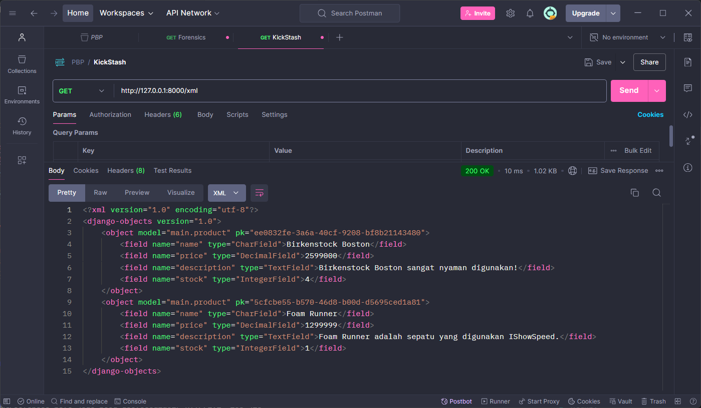
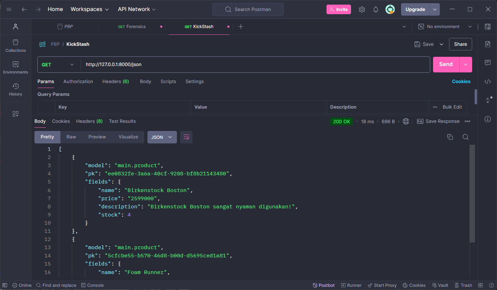
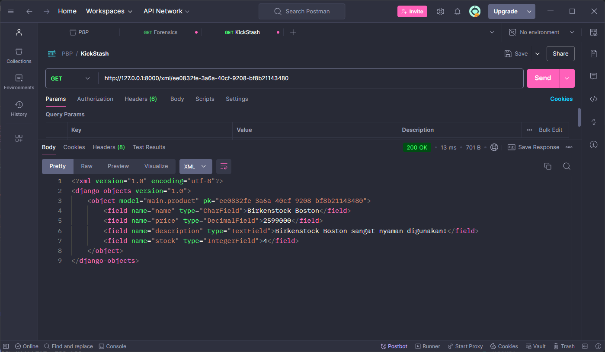
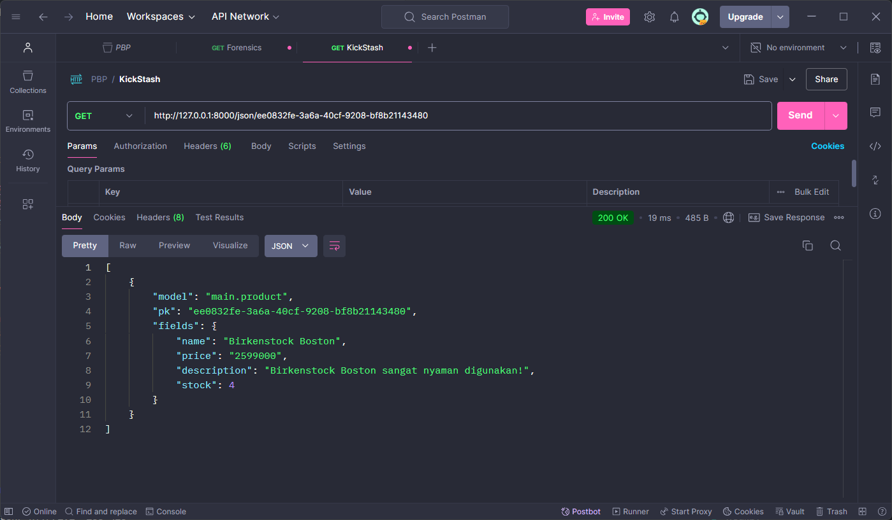

# KickStash

-   [URLs](#URLs)
-   [Pertanyaan dan Jawaban](#Pertanyaan-dan-Jawaban)
    -   [Tugas 6](#Tugas-6--Pertanyaan-dan-Jawaban)
    -   [Tugas 5](#Tugas-5--Pertanyaan-dan-Jawaban)
    -   [Tugas 4](#Tugas-4--Pertanyaan-dan-Jawaban)
    -   [Tugas 3](#Tugas-3--Pertanyaan-dan-Jawaban)
    -   [Tugas 2](#Tugas-2--Pertanyaan-dan-Jawaban)
-   [Checklist Tugas](#Checklist-Tugas)
    -   [Tugas 6](#Tugas-6--Checklist)
    -   [Tugas 5](#Tugas-5--Checklist)
    -   [Tugas 4](#Tugas-4--Checklist)
    -   [Tugas 3](#Tugas-3--Checklist)
    -   [Tugas 2](#Tugas-2--Checklist)

## URLs

URL (deployed via PWS):  
http://daffa-abhipraya-kickstash.pbp.cs.ui.ac.id/

## Pertanyaan dan Jawaban

### Tugas 6 — Pertanyaan dan Jawaban

1. Jelaskan manfaat dari penggunaan JavaScript dalam pengembangan aplikasi web!

    **_Jawab_**:

    JavaScript memiliki manfaat yang sangat besar dalam pengembangan aplikasi web, di antaranya adalah sebagai berikut.

    - **Interaktivitas**:  
      JavaScript memungkinkan developer untuk menambahkan interaktivitas ke halaman web, seperti _animations_, _pop-ups_, _form validation_, dan _real-time updates_. Hal ini meningkatkan pengalaman pengguna dan membuat aplikasi lebih menarik.
    - **AJAX**:
      JavaScript memungkinkan developer untuk mengirim dan menerima data dari server tanpa perlu me-_refresh_ halaman. Ini memungkinkan aplikasi untuk menjadi lebih responsif dan dinamis.
    - **DOM Manipulation**:
      JavaScript memungkinkan developer untuk memanipulasi elemen HTML dan CSS di halaman web, seperti menambahkan, menghapus, atau mengubah elemen. Hal ini memungkinkan developer untuk membuat tata letak yang dinamis dan responsif.
    - **Third-Party Libraries**:
      JavaScript memiliki banyak _third-party libraries_ dan _frameworks_ yang memperluas fungsionalitas dan mempercepat pengembangan aplikasi web, seperti React, Angular, dan Vue.
    - **Cross-Platform Compatibility**:
      JavaScript dapat dijalankan di berbagai _browsers_ dan perangkat, sehingga memungkinkan developer untuk membuat aplikasi yang kompatibel dengan berbagai platform.

2. Jelaskan fungsi dari penggunaan `await` ketika kita menggunakan `fetch()`! Apa yang akan terjadi jika kita tidak menggunakan `await`?

    **_Jawab_**:

    `await` digunakan untuk menunggu hasil dari _promise_ yang dikembalikan oleh `fetch()`. Tanpa `await`, `fetch()` akan mengembalikan _promise_ yang belum selesai, sehingga kita tidak dapat mengakses data yang dikembalikan oleh _promise_ tersebut.

    Jika kita tidak menggunakan `await`, maka `fetch()` akan mengembalikan _promise_ yang belum selesai. Hal ini akan menjadi fatal jika ada beberapa operasi yang bergantung pada hasil dari `fetch()`, karena operasi tersebut akan dijalankan sebelum `fetch()` selesai.

3. Mengapa kita perlu menggunakan _decorator_ `csrf_exempt` pada _view_ yang akan digunakan untuk AJAX `POST`?

    **_Jawab_**:

    Kita perlu menggunakan _decorator_ `csrf_exempt` pada _view_ yang akan digunakan untuk AJAX `POST` karena Django secara _default_ memerlukan _CSRF token_ untuk setiap _POST request_. Namun, pada kasus AJAX, _CSRF token_ tidak dapat di-_generate_ secara otomatis oleh Django, sehingga kita perlu menonaktifkan _CSRF protection_ untuk _view_ tersebut.

    Dengan menggunakan _decorator_ `csrf_exempt`, kita memberitahu Django untuk tidak memeriksa _CSRF token_ pada _POST request_ yang dikirimkan ke _view_ tersebut, sehingga kita dapat mengirimkan _POST request_ dari AJAX tanpa masalah.

4. Pada tutorial PBP minggu ini, pembersihan data _input_ pengguna dilakukan di belakang (_backend_) juga. Mengapa hal tersebut tidak dilakukan di _frontend_ saja?

    **_Jawab_**:

    Pembersihan data _input_ pengguna dilakukan di belakang (_backend_) juga karena beberapa alasan berikut.

    - **Security**:  
      Pembersihan data di _frontend_ hanya bersifat _client-side_ dan dapat dengan mudah diubah dan di-_bypass_ oleh penyerang. Pembersihan data di _backend_ memastikan bahwa data yang diterima adalah valid dan aman untuk diproses, karena tidak bisa diubah oleh pengguna.
    - **Consistency**:  
      Pembersihan data di _backend_ memastikan bahwa semua data yang diterima oleh aplikasi telah melalui proses pembersihan yang sama, sehingga mengurangi kesalahan dan inkonsistensi.
    - **Validation**:  
      Pembersihan data di _backend_ dapat digabungkan dengan validasi data untuk memastikan bahwa data yang diterima sesuai dengan aturan dan keamanan aplikasi.

5. Jelaskan bagaimana cara kamu mengimplementasikan _checklist_ di atas secara _step-by-step_ (bukan hanya sekadar mengikuti tutorial)!

    **_Jawab_**:

    1. Pertama, saya membuat fungsi untuk membuat product dengan menggunakan AJAX di `views.py`:

    ```python
    @csrf_exempt
    @require_POST
    def add_product_ajax(req):
        name = strip_tags(req.POST.get("name"))
        description = strip_tags(req.POST.get("description"))
        price = req.POST.get("price")
        stock = req.POST.get("stock")
        user = req.user

        new_product = Product(
            name=name, description=description, price=price, stock=stock, user=user
        )
        new_product.save()

        return HttpResponse(b"CREATED", status=201)
    ```

    Fungsi ini akan menerima _POST request_ dari AJAX dan membuat objek `Product` baru dengan data yang diterima. Tidak lupa, saya mematikan CSRF agar AJAX dapat mengirimkan _POST request_ di aplikasi Django.

    Saya juga menambahkan _routing_ untuk fungsi ini di `urls.py` aplikasi `main`.

    ```python
    path("create-product-ajax", add_product_ajax, name="add_product_ajax"),
    ```

    2. Masih di `views.py`, saya menghapus beberapa bagian dari `show_main` _function_ yang tidak diperlukan, karena saya akan menggunakan _async_ function di `main.html` menggunakan AJAX.

    Bagian yang saya hapus adalah

    ```python
    products = Product.objects.filter(user=req.user)
    ...
    context = {
        ...
        "products": products,
        ...
    }
    ```

    3. Melanjuti nomor 2, saya menambah _async_ function di `main.html` untuk me-_request_ data ke server menggunakan AJAX.

    ```js
    async function getProducts() {
    	return fetch("").then((res) => res.json());
    }
    ```

    Lalu, fungsi ini akan digunakan untuk meng-_iterate_ setiap produk yang didapat, lalu memasukkan informasi setiap produk ke dalam sebuah `card_product`:

    ```js
    async function refreshProducts() {
      document.getElementById('product_cards').innerHTML = '';
      document.getElementById('product_cards').className = '';
      const products = await getProducts();
      let htmlString = '';
      let classNameString = '';

      if (products.length === 0) {
        classNameString = 'w-full flex flex-col items-center justify-center space-y-2 !mb-12';
        htmlString = `
          <p>No products available.</p>
          
        `;
      } else {
        classNameString = 'w-full grid grid-cols-2 md:grid-cols-3 lg:grid-cols-4 md:gap-6 gap-2 !mb-12';
        products.forEach((item) => {
          <!-- Wrap setiap produk dengan product card -->
        });
      }
    }
    ```

    Karena sudah ada fungsi yang mengambil data produk dan me-_wrap_ setiap produk dengan _product card_, maka kode HTML bagian ini yang sebelumnya ada di `main.html` saya hapus, dan digantikan dengan _div_ yang akan diisi oleh produk yang didapat dari server, yaitu _div_ dengan `product_cards` sebagai ID.

    4. Saya membuat tombol baru bertuliskan `Add Product (AJAX)` di `main.html` yang akan memunculkan modal ketika di-_click_.

    ```html
    <button class="bg-[#8957f6] hover:bg-opacity-100 hover:text-white bg-opacity-10 text-[#8957f6] border border-[#8957f6] font-bold py-2 px-4 rounded-lg transition duration-300 ease-in-out transform flex-row space-x-2 flex items-center justify-center add-button" data-modal-target="crudModal" data-modal-toggle="crudModal" onclick="showModal();">
    	<svg xmlns="http://www.w3.org/2000/svg" width="20" height="20" viewBox="0 0 24 24" fill="none" stroke="currentColor" stroke-width="2" stroke-linecap="round" stroke-linejoin="round" class="lucide lucide-package-plus">
    		<path d="M16 16h6" />
    		<path d="M19 13v6" />
    		<path d="M21 10V8a2 2 0 0 0-1-1.73l-7-4a2 2 0 0 0-2 0l-7 4A2 2 0 0 0 3 8v8a2 2 0 0 0 1 1.73l7 4a2 2 0 0 0 2 0l2-1.14" />
    		<path d="m7.5 4.27 9 5.15" />
    		<polyline points="3.29 7 12 12 20.71 7" />
    		<line x1="12" x2="12" y1="22" y2="12" />
    	</svg>
    	<p>Add New Product (AJAX)</p>
    </button>
    ```

    Dan ini adalah fungsi JS yang akan memunculkan modal ketika tombol di-_click_.

    ```js
    function showModal() {
    	const modal = document.getElementById('crudModal');
    	const modalContent = document.getElementById('crudModalContent');

    	modal.classList.remove('hidden');
    	setTimeout(() => {
    		modalContent.classList.remove('opacity-0', 'scale-95');
    		modalContent.classList.add('opacity-100', 'scale-100');
    	}, 50);
    }
    ```

    5. Setelah itu, saya membuat sebuah `modal` di `main.html` yang akan muncul ketika tombol `Add Product (AJAX)` di-_click_. Modal ini sudah saya sesuaikan dengan theme aplikasi yang saya terapkan.

    ```html
    <div id="crudModal" tabindex="-1" aria-hidden="true" class="hidden fixed inset-0 z-50 w-full flex items-center justify-center overflow-x-hidden overflow-y-auto transition-opacity duration-300 ease-out">
    	<div id="crudModalContent" class="relative bg-[#1a1a1a] rounded-lg shadow-lg w-5/6 sm:w-3/4 md:w-1/2 lg:w-1/3 mx-4 sm:mx-0 transform scale-95 opacity-0 transition-transform transition-opacity duration-300 ease-out">
    		<!-- Modal header -->
    		<div class="flex items-center justify-between p-4 rounded-t">
    			<h3 class="text-xl font-semibold">Add New Product</h3>
    			<button type="button" class="text-gray-400 bg-transparent hover:bg-gray-200 hover:text-gray-900 rounded-lg text-sm p-1.5 ml-auto inline-flex items-center" id="closeModalBtn">
    				<svg aria-hidden="true" class="w-5 h-5" fill="currentColor" viewBox="0 0 20 20" xmlns="http://www.w3.org/2000/svg">
    					<path fill-rule="evenodd" d="M4.293 4.293a1 1 0 011.414 0L10 8.586l4.293-4.293a1 1 0 111.414 1.414L11.414 10l4.293 4.293a1 1 0 01-1.414 1.414L10 11.414l-4.293 4.293a1 1 0 01-1.414-1.414L8.586 10 4.293 5.707a1 1 0 010-1.414z" clip-rule="evenodd"></path>
    				</svg>
    				<span class="sr-only">Close modal</span>
    			</button>
    		</div>
    		<!-- Modal body -->
    		<div class="px-6 py-4 space-y-6 form-style">
    			<form id="productForm">
    				<div class="mb-4">
    					<label for="name" class="block text-sm font-medium">Name</label>
    					<input type="text" id="name" name="name" class="mt-1 block w-full border rounded-md p-2 hover:border-[#0b79f7]" placeholder="Enter your product name" required />
    				</div>
    				<div class="mb-4">
    					<label for="description" class="block text-sm font-medium">Description</label>
    					<textarea id="description" name="description" rows="3" class="mt-1 block w-full h-52 resize-none border rounded-md p-2 hover:border-[#0b79f7]" placeholder="Describe your product" required></textarea>
    				</div>
    				<div class="mb-4">
    					<label for="price" class="block text-sm font-medium">Price (in IDR)</label>
    					<input type="number" id="price" name="price" min="1" max="999999999999" class="mt-1 block w-full border rounded-md p-2 hover:border-[#0b79f7]" required />
    				</div>
    				<div class="mb-4">
    					<label for="stock" class="block text-sm font-medium">Stock (minimum of 1)</label>
    					<input type="number" id="stock" name="stock" min="1" max="999999999999" class="mt-1 block w-full border rounded-md p-2 hover:border-[#0b79f7]" required />
    				</div>
    			</form>
    		</div>
    		<!-- Modal footer -->
    		<div class="flex flex-col space-y-2 md:flex-row md:space-y-0 md:space-x-2 p-6 border-gray-200 rounded-b justify-center md:justify-end">
    			<button type="button" class="flex items-center justify-center flex-row items-center justify-center rounded-lg py-1 space-x-1 transition duration-300 hover:bg-[#cccccc] hover:text-[#262626] border border-[#cccccc] px-3" id="cancelButton">Cancel</button>
    			<button type="submit" id="submitProduct" form="productForm" class="flex items-center justify-center flex-row items-center justify-center rounded-lg px-3 py-1 space-x-1 transition duration-300 bg-yellow-600 hover:bg-opacity-100 hover:text-white bg-opacity-10 text-yellow-600 border border-yellow-600">Save</button>
    		</div>
    	</div>
    </div>
    ```

    Tidak lupa, saya juga membuat fungsi untuk melakukan _close_ modal ketika tombol `X` atau `Cancel` di-_click_.

    ```js
    const modal = document.getElementById('crudModal');
    const modalContent = document.getElementById('crudModalContent');

    function hideModal() {
    	const modal = document.getElementById('crudModal');
    	const modalContent = document.getElementById('crudModalContent');

    	modalContent.classList.remove('opacity-100', 'scale-100');
    	modalContent.classList.add('opacity-0', 'scale-95');

    	setTimeout(() => {
    		modal.classList.add('hidden');
    	}, 150);
    }

    document.getElementById('cancelButton').addEventListener('click', hideModal);
    document.getElementById('closeModalBtn').addEventListener('click', hideModal);
    ```

    5. Terakhir, saya menerapkan fungsi untuk meng-_handle_ _submit_ form produk yang akan dikirimkan ke server menggunakan AJAX.

    ```js
    function addProduct() {
    	fetch("", {
    		method: 'POST',
    		body: new FormData(document.querySelector('#productForm')),
    	}).then((response) => refreshProducts());

    	document.getElementById('productForm').reset();
    	hideModal();

    	return false;
    }

    document.getElementById('productForm').addEventListener('submit', (e) => {
    	e.preventDefault();
    	addProduct();
    });
    ```

### Tugas 5 — Pertanyaan dan Jawaban

1. Jika terdapat beberapa CSS selector untuk suatu elemen HTML, jelaskan urutan prioritas pengambilan CSS selector tersebut!

    **_Jawab_**:

    Urutan prioritas pengambilan CSS selector adalah sebagai berikut.

    1. **Inline Styles**:  
       Inline styles memiliki prioritas tertinggi, sehingga akan mengambil alih semua properti CSS lainnya.
    2. **ID Selectors**:  
       ID selectors memiliki prioritas lebih tinggi daripada class selectors, sehingga akan mengambil alih properti CSS yang sama dari class selectors.
    3. **Class Selectors**:  
       Class selectors memiliki prioritas lebih tinggi daripada tag selectors, sehingga akan mengambil alih properti CSS yang sama dari tag selectors.
    4. **Tag Selectors**:  
       Tag selectors memiliki prioritas terendah, sehingga akan diambil alih oleh class selectors dan ID selectors.

2. Mengapa _responsive design_ menjadi konsep yang penting dalam pengembangan aplikasi _web_? Berikan contoh aplikasi yang sudah dan belum menerapkan _responsive design_!

    **_Jawab_**:

    _Responsive design_ menjadi konsep yang penting dalam pengembangan aplikasi _web_ karena beberapa alasan berikut.

    - **Multi-Device Compatibility**:  
      _Responsive design_ memungkinkan aplikasi untuk berfungsi dengan baik di berbagai perangkat, seperti _desktop_, _tablet_, dan _mobile_.
    - **User Experience**:  
      _Responsive design_ meningkatkan pengalaman pengguna dengan menyediakan tata letak yang mudah dinavigasi dan mudah dibaca di berbagai perangkat.
    - **SEO**:  
      _Responsive design_ membantu meningkatkan peringkat SEO dengan memberikan pengalaman pengguna yang lebih baik dan mengurangi _bounce rate_.
    - **Cost-Effective**:  
      _Responsive design_ mengurangi biaya pengembangan karena hanya perlu membuat satu aplikasi yang dapat beradaptasi dengan berbagai perangkat.

    Contoh aplikasi yang sudah menerapkan _responsive design_ adalah Google dan Facebook, di mana kedua aplikasi ini dapat berfungsi dengan baik di berbagai perangkat. Contoh aplikasi yang belum menerapkan _responsive design_ adalah aplikasi SIAK-NG Universitas Indonesia.

3. Jelaskan perbedaan antara _margin_, _border_, dan _padding_, serta cara untuk mengimplementasikan ketiga hal tersebut!

    - **_Margin_**:  
      _Margin_ adalah ruang di sekeliling elemen HTML yang memisahkan elemen tersebut dari elemen lainnya. _Margin_ dapat diatur menggunakan properti `margin` di CSS.
    - **_Border_**:  
      _Border_ adalah garis yang mengelilingi elemen HTML. _Border_ dapat diatur menggunakan properti `border` di CSS.
    - **_Padding_**:  
      _Padding_ adalah ruang di sekeliling konten elemen HTML yang memisahkan konten dari _border_. _Padding_ dapat diatur menggunakan properti `padding` di CSS.

    Cara mengimplementasikan _margin_, _border_, dan _padding_ adalah dengan menambahkan properti CSS yang sesuai ke elemen HTML yang diinginkan. Berikut adalah contoh penggunaan properti CSS untuk _margin_, _border_, dan _padding_.

    ```css
    .element {
    	margin: 10px;
    	border: 1px solid black;
    	padding: 10px;
    }
    ```

4. **Jelaskan konsep _flex box_ dan _grid layout_ beserta kegunaannya!**

    **Konsep**:

    - **_Flexbox_**:  
      _Flexbox_ adalah model tata letak yang memungkinkan
      developer untuk membuat tata letak yang responsif dan fleksibel tanpa menggunakan _float_ atau _positioning_. _Flexbox_ memungkinkan developer untuk mengatur elemen dalam
      baris atau kolom, menyesuaikan
      ukuran elemen, dan menentukan
      _alignment_ dan _order_ elemen.
    - **_Grid Layout_**:
      _Grid Layout_ adalah model tata letak yang memungkinkan developer untuk membuat tata letak yang kompleks dan responsif dengan menggunakan _grid_ dua dimensi. _Grid Layout_ memungkinkan developer untuk membuat _grid_ dengan baris dan kolom, menentukan _alignment_ dan _spacing_ elemen, dan mengatur elemen dalam _grid_.

    **Kegunaan**:

    - **_Flexbox_**:  
      _Flexbox_ berguna untuk membuat tata letak yang fleksibel dan responsif, seperti _navigation bar_, _sidebar_, dan _card layout_.
    - **_Grid Layout_**:
      _Grid Layout_ berguna untuk membuat tata letak yang kompleks dan responsif, seperti _grid gallery_, _dashboard_, dan _form layout_.

5. **Jelaskan bagaimana cara kamu mengimplementasikan _checklist_ di atas secara _step-by-step_ (bukan hanya sekadar mengikuti tutorial)!**

    **_Jawab_**:

    1. Menerapkan Tailwind CSS pada aplikasi Django dengan menambahkan

        ```html
        <script src="https://cdn.tailwindcss.com"></script>
        ```

        pada `<head>` di `base.html`.

    2. Menambahkan fitur `edit_product` dan `delete_product` pada aplikasi di `views.py` dan `urls.py`.

        ```python
        def edit_product(req, id):
            product = Product.objects.get(pk=id)
            form = ProductForm(req.POST or None, instance=product)

            if form.is_valid() and req.method == "POST":
                form.save()
                return HttpResponseRedirect(reverse("main:show_main"))

            context = {"form": form}
            return render(req, "edit_product.html", context)


        def delete_product(req, id):
            product = Product.objects.get(pk=id)
            product.delete()
            return HttpResponseRedirect(reverse("main:show_main"))
        ```

        Lalu, menambahkan _routing_ untuk kedua fungsi tersebut di `urls.py`.

    3. Membuat beberapa elemen HTML pada aplikasi menggunakan Tailwind CSS, termasuk:

        - _NavBar_ yang _responsive_.
        - _Card_ untuk menampilkan _product_.
        - _Button_ untuk mengedit dan menghapus _product_ pada _card_.

    4. Menerapkan styling tambahan dengan Tailwind CSS pada elemen HTML yang sudah dibuat, seperti _background color_, _text color_, _margin_, _padding_, dan _border_.

### Tugas 4 — Pertanyaan dan Jawaban

1. Apa perbedaan antara `HttpResponseRedirect()` dan `redirect()`?

    **_Jawab_**:

    Perbedaan antara `HttpResponseRedirect()` dan `redirect()` adalah sebagai berikut.

    a. `HttpResponseRedirect()`:

    - Mengembalikan status kode `302` yang berarti bahwa browser harus melakukan pengalihan ke URL yang diberikan.
    - Penggunaanya:
        ```python
        from django.http import HttpResponseRedirect
        return HttpResponseRedirect('/some/url/')
        ```
    - Memerlukan _absolute path_ atau _full URL_.

    b. `redirect()`:

    - Mengembalikan objek `HttpResponseRedirect` yang sama dengan `HttpResponseRedirect()`.
    - Penggunaanya:
        ```python
        from django.shortcuts import redirect
        return redirect('/some/url/')
        ```
    - Memungkinkan penggunaan _named URL patterns_ dan _relative paths_.
    - Juga memungkinkan untuk _pass_ argumen tambahan seperti `args` dan `kwargs`.

    Dengan kata lain, `redirect()` adalah _shortcut_ dari `HttpResponseRedirect()` yang lebih fleksibel.

2. Jelaskan cara kerja penghubungan model `Product` dengan `User`!

    **_Jawab_**:

    a. **Membuat Relasi**:

    - Membuat relasi antara model `Product` dan `User` dengan menggunakan _foreign key_.
    - Menambahkan atribut `user` pada model `Product` yang merujuk ke model `User`.

    b. **Menghubungkan Data**:

    - Ketika membuat objek `Product`, kita juga menyimpan ID pengguna yang sedang _logged in_ ke atribut `user`.
    - Dengan demikian, kita dapat mengetahui produk mana yang dimiliki oleh pengguna tertentu.

    c. **Menampilkan Data**:

    - Ketika menampilkan data produk, kita hanya menampilkan produk yang dimiliki oleh pengguna yang sedang _logged in_, bukan semua produk yang ada di database.

3. Apa perbedaan antara _authentication_ dan _authorization_, apakah yang dilakukan saat pengguna login? Jelaskan bagaimana Django mengimplementasikan kedua konsep tersebut.

    **_Jawab_**:

    a. **Authentication**:

    - _Authentication_ adalah proses verifikasi identitas pengguna, yaitu memastikan bahwa pengguna adalah siapa yang mereka klaim.
    - Saat pengguna login, Django memeriksa kredensial pengguna (seperti _username_ dan _password_) dan memverifikasi apakah mereka cocok dengan yang ada di database.
    - Django menggunakan _session_ untuk menyimpan informasi _authentication_ pengguna, seperti _user ID_ dan _username_.

    b. **Authorization**:

    - _Authorization_ adalah proses menentukan hak akses pengguna, yaitu apa yang diizinkan pengguna lakukan setelah mereka terautentikasi.
    - Django menggunakan _permissions_ dan _groups_ untuk mengatur hak akses pengguna, seperti siapa yang dapat menambahkan, mengedit, atau menghapus objek tertentu.
    - Saat pengguna login, Django memeriksa _permissions_ dan _groups_ pengguna untuk menentukan apa yang mereka dapat lakukan di aplikasi.

    c. **Implementasi Django**:

    - Django menyediakan _authentication_ dan _authorization_ bawaan melalui `django.contrib.auth`.
    - _Authentication_ diimplementasikan melalui `User` model dan `auth` views, seperti `login`, `logout`, dan `register`.
    - _Authorization_ diimplementasikan melalui _permissions_ dan _groups_ yang dapat ditambahkan ke model dan _views_. Pengguna dapat diberikan hak akses berdasarkan _permissions_ dan _groups_ yang mereka miliki.

4. Bagaimana Django mengingat pengguna yang telah login? Jelaskan kegunaan lain dari _cookies_ dan apakah semua cookies aman digunakan?

    **_Jawab_**:

    a. **Django Session Framework**:

    - Django menggunakan _session_ untuk mengingat pengguna yang telah login.
    - Saat pengguna login, Django membuat _session_ unik untuk pengguna tersebut dan menyimpannya di database.
    - _Session_ ini kemudian digunakan untuk mengidentifikasi pengguna di setiap _request_ yang mereka lakukan.

    b. **Cookies**:

    - _Cookies_ adalah data kecil yang disimpan di _client_ (_browser_) pengguna.
    - _Cookies_ digunakan untuk menyimpan informasi seperti _session key_, preferensi pengguna, dan _last login_.
    - _Session key_ yang digunakan oleh Django disimpan di _cookies_ pengguna untuk mengidentifikasi pengguna yang telah login.

    c. **Keamanan Cookies**:

    - Tidak semua _cookies_ aman digunakan, terutama _cookies_ yang menyimpan informasi sensitif seperti _password_.
    - _Cookies_ yang tidak dienkripsi atau tidak di-_secure_ dapat rentan terhadap serangan

5. Jelaskan bagaimana cara kamu mengimplementasikan _checklist_ di atas secara _step-by-step_ (bukan hanya sekadar mengikuti tutorial).

    **_Jawab_**:

    1. Pertama, saya membuat form register menggunakan `UserCreationForm` dari `django.contrib.auth.forms` di `views.py` aplikasi `main`.

        ```python
        def register(request):
            form = UserCreationForm()

            if request.method == "POST":
                form = UserCreationForm(request.POST)
                if form.is_valid():
                    form.save()
                    messages.success(request, 'Your account has been successfully created!')
                    return redirect('main:login')
            context = {'form':form}
            return render(request, 'register.html', context)
        ```

        Tidak lupa, saya juga membuat page HTML sederhananya untuk form registrasi ini, yaitu `register.html` di dalam direktori `templates/main`.

        ```html
        <form method="POST">
        	
        	<table>
        		{{ form.as_table }}
        		<tr>
        			<td></td>
        			<td>
        				<input type="submit" name="submit" value="Daftar" />
        			</td>
        		</tr>
        	</table>
        </form>
        ```

        Lalu, saya menambahkan page ini ke `urls.py` di dalam direktori `main` agar dapat diakses di `/register`.

    2. Kedua, saya membuat form login menggunakan `AuthenticationForm` dari `django.contrib.auth.forms` dan method `authenticate` & `login` dari `django.contrib.auth` di `views.py` aplikasi `main`.

        ```python
        def login_user(request):
          if request.method == "POST":
              form = AuthenticationForm(data=request.POST)

              if form.is_valid():
                  user = form.get_user()
                  login(request, user)
                  response = HttpResponseRedirect(reverse("main:show_main"))
                  response.set_cookie('last_login', str(datetime.datetime.now()))
                  return response

          else:
              form = AuthenticationForm(request)
          context = {"form": form}
          return render(request, "login.html", context)
        ```

        Di sini, saya langsung _set_ cookie `last_login` dengan waktu saat ini ketika pengguna berhasil login menggunakan library `datetime`.

        Setelah itu, saya membuat page HTML baru untuk form login ini, yaitu `login.html` di dalam direktori `templates/main`, mirip seperti `register.html`. Bedanya yang paling signifikan adalah adanya link untuk menuju halaman registrasi.

        Saya juga tidak lupa menambahkan page ini ke `urls.py` di dalam direktori `main` agar dapat diakses di `/login`.

    3. Fungsi terakhir yang saya buat adalah logout menggunakan method `logout` dari `django.contrib.auth` di `views.py` aplikasi `main`.

        ```python
        def logout_user(request):
          logout(reqreuest)
          response = HttpResponseRedirect(reverse('main:login'))
          response.delete_cookie('last_login')
          return response
        ```

        Saya langsung menerapkan delete cookie `last_login` ketika pengguna logout.

        Saya juga menambahkan fungsi ini ke `urls.py` di dalam direktori `main` agar dapat diakses di `/logout`.

    4. Untuk langkah-langkah terakhir, saya melakukan beberapa hal:

        - Menambahkan `@login_required(login_url='/login')` di `show_main` agar hanya pengguna yang sudah login yang dapat mengakses halaman utama.
        - Menambahkan 2 _context_ untuk ditampilkan di _main page_:
            ```python
            'last_login': req.COOKIES['last_login'],
            'name': req.user.username,
            ```
        - Menambahkan `last_login` dan `name` ke _main page_ agar dapat ditampilkan.
        - Menambahkan _button_ untuk logout di _main page_ yang mengarahkan ke `/logout`.
        - Mengubah cara mengambil produk di fungsi `show_main` di `views.py` agar hanya mengambil produk milik _user_ yanng sedang login.
            ```python
            products = Product.objects.filter(user=req.user)
            ```

### Tugas 3 — Pertanyaan dan Jawaban

1. Jelaskan mengapa kita memerlukan _data delivery_ dalam pengimplementasian sebuah platform?

    **_Jawab_**:

    Kita perlu _data delivery_ karena beberapa alasan berikut.

    - Memungkinkan platform dalam mengirimkan data dalam bentuk XML atau JSON, sehingga aplikasi klien mudah untuk menggunakan dan mengolah data tersebut.
    - Berguna untuk memisahkan antara _backend_ dan _frontend_ sehingga memungkinkan pengembangan aplikasi yang lebih modular dan terstruktur.
    - Memungkinkan aplikasi untuk berkomunikasi dengan _third-party services_ dan _APIs_ lainnya dengan mudah.
    - Memastikan bahwa hanya data yang diperlukan yang dikirimkan ke aplikasi klien, sehingga mengurangi _overhead_, mempercepat _loading time_, dan melindungi data lainnya.

2. Menurutmu, mana yang lebih baik antara XML dan JSON? Mengapa JSON lebih populer dibandingkan XML?

    **_Jawab_**:

    JSON **lebih baik** daripada XML. Hal ini disebabkan oleh beberapa alasan berikut.

    a. **Ringkas**: JSON lebih ringkas daripada XML, karena hanya membutuhkan sedikit karakter untuk merepresentasikan data yang sama.

    b. **Mudah Di-_parse_**: JSON lebih mudah di-parse oleh bahasa pemrograman modern.

    c. **Mudah Dibaca**: JSON lebih mudah dibaca oleh manusia karena strukturnya yang sederhana.

3. Jelaskan fungsi dari method `is_valid()` pada form Django dan mengapa kita membutuhkan method tersebut?

    **_Jawab_**:

    Method `is_valid()` pada form Django berguna untuk memvalidasi apakah data yang diisikan di form mengikuti aturan yang dibuat di class form yang dibuat, seperti misalnya di kode saya, `ProductForm`. Ini mencakup validasi seperti _required fields_, _data types_, dan lainnya.

4. Mengapa kita membutuhkan `csrf_token` saat membuat form di Django? Apa yang dapat terjadi jika kita tidak menambahkan `csrf_token` pada form Django? Bagaimana hal tersebut dapat dimanfaatkan oleh penyerang?

    **_Jawab_**:

    Kita membutuhkan `csrf_token` saat membuat form di Django untuk melindungi aplikasi dari serangan _Cross-Site Request Forgery_ (CSRF). Jika kita tidak menambahkan `csrf_token` pada form Django, maka penyerang dapat memanfaatkan celah ini untuk melakukan serangan CSRF, di mana penyerang dapat mengirimkan _request_ palsu ke aplikasi yang memanfaatkan _session_ yang sudah ada di _client_.

5. Jelaskan bagaimana cara kamu mengimplementasikan _checklist_ di atas secara _step-by-step_ (bukan hanya sekadar mengikuti tutorial).

    **_Jawab_**:

    1. Pertama, saya membuat file `base.html` di `/templates` berisi block `meta` dan `content` yang akan di-extend atau diisi oleh HTML lainnya.

        ```html
        
        <!DOCTYPE html>
        <html lang="en">
        	<head>
        		<meta charset="UTF-8" />
        		<meta name="viewport" content="width=device-width, initial-scale=1.0" />
        		 
        	</head>

        	<body>
        		 
        	</body>
        </html>
        ```

        Tidak lupa, saya juga menambahkan base template HTML tersebut ke `TEMPLATES` di `/kickstash/settings.py` agar dikenali oleh Django. Setelah itu, saya me-_refactor_ `main.html` di `/main/templates` untuk meng-extend `base.html`.

        Hal ini guna mempersingkat kode HTML yang akan digunakan di setiap halaman.

    2. Saya membuat form `ProductForm` di `forms.py` yang akan digunakan untuk menambahkan objek dengan model `Product` ke database.

        ```python
        class ProductForm(ModelForm):
          class Meta:
              model = Product
              fields = ["name", "price", "description", "stock"]
        ```

        `ProductForm` yang dibuat di sana akan digunakan di `views.py` sebagai form yang akan di-_render_ ke halaman `/create-product`.

        ```python
        def create_product(req):
          form = ProductForm(req.POST or None)

          if form.is_valid() and req.method == "POST":
              form.save()
              return redirect("main:show_main")

          context = {"form": form}
          return render(req, "create_product.html", context)
        ```

        Untuk halaman `/create-product`, saya membuat sebuah file HTML baru bernama `create_product.html` di dalam direktori `/main/templates`, kurang lebih seperti ini:

        ```html
         

        <h1>Create a Product</h1>

        <form method="POST">
        	
        	<table>
        		{{ form.as_table }}
        		<tr>
        			<td></td>
        			<td>
        				<input type="submit" value="Create Product" />
        			</td>
        		</tr>
        	</table>
        </form>

        
        ```

        Selanjutnya, saya menambahkan url `create-product` ke `urls.py` di dalam direktori `/main`, agar form tersebut ditampilkan di halaman `/create-product`.

    3. Tidak lupa, saya meng-_update_ `main.html` di `/main/templates` untuk menambahkan

        - _button_ ke halaman `/create-product` agar form tersebut dapat diakses.
        - _table_ berisi data dari model `Product` yang sudah ada di database.

        Untuk menampilkan data di _table_-nya, saya mengubah _context_ yang ada di `show_main` di `views.py` menjadi seperti ini:

        ```python
        context = {
          # Credentials
          "student_name": "Daffa Abhipraya Putra",
          "student_id": "2306245131",
          "student_class": "PBP D",
          # Data
          "products": products,
        }
        ```

        `products` ini akan diterima oleh `main.html` dan di-_loop_ untuk ditampilkan sebagai _table_, sehingga saya menggunakan iterasi berikut untuk menambahkan setiap baris data ke _table_.

        ```html
         ... 
        ```

    4. Terakhir, untuk menampilkan data dalam format `XML`, `XML/[id]`, `JSON`, dan `JSON/[id]`, saya menambahkan 4 fungsi baru di `views.py` yang akan mengembalikan _response_ dalam format yang sesuai.

        ```python
        def show_xml(req):
          data = Product.objects.all()
          return HttpResponse(
              serializers.serialize("xml", data), content_type="application/xml"
          )

        def show_json(req):
          data = Product.objects.all()
          return HttpResponse(
              serializers.serialize("json", data), content_type="application/json"
          )

        def show_xml_by_id(req, id):
          data = Product.objects.filter(pk=id)
          return HttpResponse(
              serializers.serialize("xml", data), content_type="application/xml"
          )

        def show_json_by_id(req, id):
          data = Product.objects.filter(pk=id)
          return HttpResponse(
              serializers.serialize("json", data), content_type="application/json"
          )
        ```

        Kemudian, saya menambahkan _routing_ untuk masing-masing fungsi tersebut di `urls.py` di dalam direktori `/main`.

        ```python
        urlpatterns = [
          ...
          path("xml", views.get_xml, name="get_xml"),
          path("json", views.get_json, name="get_json"),
          path("xml/<str:id>", views.get_xml_by_id, name="get_xml_by_id"),
          path("json/<str:id>", views.get_json_by_id, name="get_json_by_id"),
        ]
        ```

**_EXTRA_**

Screenshot Postman:

| GET to URL Endpoint | Response (Screenshot)                             |
| ------------------- | ------------------------------------------------- |
| `/xml`              |                |
| `/json`             |              |
| `/xml/[id]`         |    |
| `/json/[id]`        |  |

### Tugas 2 — Pertanyaan dan Jawaban

1. Jelaskan bagaimana cara kamu mengimplementasikan _checklist_ di atas secara _step-by-step_ (bukan hanya sekadar mengikuti tutorial).

    **_Jawab_**:

    a. Pertama, saya membuat proyek Django baru dengan perintah `django-admin startproject kickstash .`. Kemudian, saya melakukan _routing_ pada proyek tersebut agar dapat menjalankan aplikasi `main` dengan menambahkan path `/` ke `urls.py` proyek.

    ```python
    from django.urls import path
    from main import views

    urlpatterns = [
    	path('', views.show_main, name='show_main'),
    ]
    ```

    b. Selanjutnya, saya membuat aplikasi baru dengan perintah `python3 manage.py startapp main`.

    c. Kemudian, saya membuat model `Product` di `models.py` dengan atribut `name`, `price`, dan `description`.

    ```python
    from django.db import models

    class Product(models.Model):
    	name = models.CharField(max_length=100)
    	price = models.DecimalField(max_digits=10, decimal_places=2)
    	description = models.TextField()
    ```

    Untuk sekarang, model ini belum mulai digunakan.

    d. Setelah itu, saya menyiapkan `main.html` sederhana di dalam direktori `templates` aplikasi `main` yang akan menampilkan data dari model `Product`.

    e. Setelah HTML utama selesai, saya membuat fungsi `show_main` di `views.py` yang akan mengembalikan _response_ berupa _template_ HTML yang menampilkan nama aplikasi dan nama serta kelas saya.

    ```python
    from django.shortcuts import render
    from .models import Product

    def show_main(request):
    	# Prepare pre-made context
    	context = {
    		'name': 'Birkenstock Boston',
    		'price': 2599000,
    		'description': 'Birkenstock Boston adalah sandal yang nyaman digunakan untuk berbagai aktivitas.'
    	}

    	return render(request, 'main.html', context)
    ```

    f. Selanjutnya, saya membuat _routing_ pada `urls.py` aplikasi `main` untuk membuat _path_ yang memetakan fungsi yang telah dibuat pada `views.py`.

    ```python
    from django.contrib import admin
    from django.urls import path, include

    urlpatterns = [
    	path('admin/', admin.site.urls),
    	path('', include('main.urls')),
    ]
    ```

    g. Terakhir, saya melakukan _deployment_ ke PWS terhadap aplikasi yang sudah dibuat sehingga nantinya dapat diakses melalui Internet.

2. Buatlah bagan yang berisi _request client_ ke web aplikasi berbasis Django beserta responnya dan jelaskan pada bagan tersebut kaitan antara `urls.py`, `views.py`, `models.py`, dan berkas `html`.

    **_Jawab_**:

    

    Penjelasan:

    1. User mengakses aplikasi web melalui browser dengan mengirimkan _request_ ke URL utama (`/`).
    2. _Request_ tersebut diterima oleh `urls.py` yang mengarahkannya ke fungsi `show_main` di `views.py`. Path `/` ditulis dengan `''` di `urls.py`.
    3. Fungsi `show_main` di `views.py` sudah mempunyai pre-defined model data (context) di dalamnya, sehingga tinggal mengisinya ke `templates/main.html`.
    4. `main.html` akan di-_render_ oleh `views.py` dan dikirimkan sebagai _response_ ke _client_ (browser).

3. Jelaskan fungsi `git` dalam pengembangan perangkat lunak!

    **_Jawab_**:

    Beberapa fungsi `git` yang paling penting dalam pengembangan perangkat lunak adalah sebagai berikut.

    - **Version Control**:  
      Git mencatat setiap perubahan pada kode, memungkinkan developer untuk melihat riwayat pengeditan, siapa yang mengubah apa, dan kapan perubahan tersebut dilakukan.
    - **Collaboration**:  
      Git memfasilitasi kolaborasi tim dengan memungkinkan banyak developer bekerja pada proyek yang sama tanpa mengganggu pekerjaan satu sama lain. Ini dilakukan dengan menggunakan `branching` dan `merging`.
    - **Backup**:  
      Git memungkinkan developer untuk kembali ke versi sebelumnya dari kode jika terjadi kesalahan, dengan memanfaatkan fitur seperti `commit`, `reset`, dan `checkout`.
    - **Code Review**:  
      Git memungkinkan developer untuk melakukan _code review_ dengan mudah, memungkinkan mereka untuk memberikan masukan dan saran kepada rekan tim mereka.
    - **Deployment**:  
      Git memungkinkan developer untuk melakukan _deployment_ kode ke server produksi dengan mudah, dengan memanfaatkan fitur seperti `push` dan `pull`.

4. Menurut Anda, dari semua framework yang ada, mengapa framework Django dijadikan permulaan pembelajaran pengembangan perangkat lunak?

    **_Jawab_**:

    Ada beberapa alasan yang mungkin mendasarinya, di antaranya:

    - **Struktur**:  
      Django mengikuti pola MVT (Model-View-Template) yang membantu pemula memahami pentingnya arsitektur yang terstruktur dalam pengembangan aplikasi web.
    - **Fitur Bawaan**:  
      Django dilengkapi dengan banyak fitur bawaan, seperti autentikasi, pengelolaan database, dan manajemen admin, sehingga pemula dapat fokus pada belajar konsep dasar.
    - **Keamanan**:  
      Django memiliki mekanisme keamanan bawaan seperti perlindungan terhadap CSRF, SQL injection, dan XSS.
    - **Skalabilitas**:  
      Django dirancang untuk menangani aplikasi web yang kompleks dan besar, sehingga pemula dapat mempelajari cara mengelola aplikasi yang berkembang.
    - **ORM Bawaan**:  
      Django menyediakan _ORM_ bawaan yang memungkinkan developer untuk berinteraksi dengan database tanpa menulis SQL mentah.

5. Mengapa model pada Django disebut sebagai _ORM_?

    **_Jawab_**:

    Model pada Django disebut sebagai ORM (Object-Relational Mapping) karena mereka menghubungkan struktur objek dalam kode Python dengan tabel-tabel dalam database relasional. Dengan menggunakan model Django, developer dapat berinteraksi dengan database menggunakan objek Python, tanpa perlu menulis SQL mentah.

## Checklist Tugas

### Tugas 6 — Checklist

-   [x] Mengubah tugas 5 yang telah dibuat sebelumnya menjadi menggunakan AJAX.

    -   [x] AJAX `GET`
        -   [x] Ubahlah kode `cards` data _mood_ agar dapat mendukung AJAX `GET`.
        -   [x] Lakukan pengambilan data _mood_ menggunakan AJAX `GET`. Pastikan bahwa data yang diambil hanyalah data milik pengguna yang _logged-in_.
    -   [x] AJAX `POST`
        -   [x] Buatlah sebuah tombol yang membuka sebuah modal dengan form untuk menambahkan _mood_.
        -   [x] Buatlah fungsi _view_ baru untuk menambahkan _mood_ baru ke dalam basis data.
        -   [x] Buatlah _path_ `/create-ajax/` yang mengarah ke fungsi _view_ yang baru kamu buat.
        -   [x] Hubungkan form yang telah kamu buat di dalam modal kamu ke _path_ `/create-ajax/`.
        -   [x] Lakukan _refresh_ pada halaman utama secara asinkronus untuk menampilkan daftar _mood_ terbaru tanpa reload halaman utama secara keseluruhan.

-   [x] Menjawab beberapa pertanyaan berikut pada `README.md` pada _root folder_ (silakan modifikasi `README.md` yang telah kamu buat sebelumnya; tambahkan subjudul untuk setiap tugas).
    -   [x] Jelaskan manfaat dari penggunaan JavaScript dalam pengembangan aplikasi web!
    -   [x] Jelaskan fungsi dari penggunaan `await` ketika kita menggunakan `fetch()`! Apa yang akan terjadi jika kita tidak menggunakan `await`?
    -   [x] Mengapa kita perlu menggunakan _decorator_ `csrf_exempt` pada _view_ yang akan digunakan untuk AJAX `POST`?
    -   [x] Pada tutorial PBP minggu ini, pembersihan data _input_ pengguna dilakukan di belakang (_backend_) juga. Mengapa hal tersebut tidak dilakukan di _frontend_ saja?
    -   [x] Jelaskan bagaimana cara kamu mengimplementasikan _checklist_ di atas secara _step-by-step_ (bukan hanya sekadar mengikuti tutorial)!
-   [x] Melakukan `add`-`commit`-`push` ke GitHub.

### Tugas 5 — Checklist

-   [x] Implementasikan fungsi untuk menghapus dan mengedit _product_.
-   [x] Kustomisasi desain pada _template_ HTML yang telah dibuat pada tugas-tugas sebelumnya menggunakan CSS atau CSS framework (seperti Bootstrap, Tailwind, Bulma) dengan ketentuan sebagai berikut:
    -   [x] Kustomisasi halaman _login_, _register_, dan tambah _product_ semenarik mungkin.
    -   [x] Kustomisasi halaman daftar _product_ menjadi lebih menarik dan _responsive_. Kemudian, perhatikan kondisi berikut:
        -   [x] Jika pada aplikasi belum ada _product_ yang tersimpan, halaman daftar _product_ akan menampilkan gambar dan pesan bahwa belum ada _product_ yang terdaftar.
        -   [x] Jika sudah ada _product_ yang tersimpan, halaman daftar _product_ akan menampilkan detail setiap _product_ dengan menggunakan **_card_** (**tidak boleh sama persis dengan desain pada Tutorial!**).
    -   [x] Untuk setiap **_card product_**, buatlah dua buah _button_ untuk mengedit dan menghapus _product_ pada **_card_** tersebut!
    -   [x] Buatlah _navigation bar_ (_navbar_) untuk fitur-fitur pada aplikasi yang _responsive_ terhadap perbedaan ukuran _device_, khususnya _mobile_ dan _desktop_.
-   [x] Menjawab beberapa pertanyaan berikut pada `README.md` pada _root folder_ (silakan modifikasi `README.md` yang telah kamu buat sebelumnya; tambahkan subjudul untuk setiap tugas).
    -   [x] Jika terdapat beberapa CSS selector untuk suatu elemen HTML, jelaskan urutan prioritas pengambilan CSS selector tersebut!
    -   [x] Mengapa _responsive design_ menjadi konsep yang penting dalam pengembangan aplikasi _web_? Berikan contoh aplikasi yang sudah dan belum menerapkan _responsive design_!
    -   [x] Jelaskan perbedaan antara _margin_, _border_, dan _padding_, serta cara untuk mengimplementasikan ketiga hal tersebut!
    -   [x] Jelaskan konsep _flex box_ dan _grid layout_ beserta kegunaannya!
    -   [x] Jelaskan bagaimana cara kamu mengimplementasikan _checklist_ di atas secara _step-by-step_ (bukan hanya sekadar mengikuti tutorial)!
-   [x] Melakukan `add`-`commit`-`push` ke GitHub.

### Tugas 4 — Checklist

-   [x] Mengimplementasikan fungsi registrasi, login, dan logout untuk memungkinkan pengguna untuk mengakses aplikasi sebelumnya dengan lancar.
-   [x] Membuat **dua** akun pengguna dengan masing-masing **tiga** _dummy data_ menggunakan model yang telah dibuat pada aplikasi sebelumnya untuk setiap akun **di lokal**.
-   [x] Menghubungkan model `Product` dengan `User`.
-   [x] Menampilkan detail informasi pengguna yang sedang _logged in_ seperti _username_ dan menerapkan `cookies` seperti `last login` pada halaman utama aplikasi.
-   [ ] Menjawab beberapa pertanyaan berikut pada `README.md` pada _root folder_ (silakan modifikasi `README.md` yang telah kamu buat sebelumnya; tambahkan subjudul untuk setiap tugas).
    -   [ ] Apa perbedaan antara `HttpResponseRedirect()` dan `redirect()`
    -   [ ] Jelaskan cara kerja penghubungan model `Product` dengan `User`!
    -   [ ] Apa perbedaan antara _authentication_ dan _authorization_, apakah yang dilakukan saat pengguna login? Jelaskan bagaimana Django mengimplementasikan kedua konsep tersebut.
    -   [ ] Bagaimana Django mengingat pengguna yang telah login? Jelaskan kegunaan lain dari _cookies_ dan apakah semua cookies aman digunakan?
    -   [ ] Jelaskan bagaimana cara kamu mengimplementasikan _checklist_ di atas secara _step-by-step_ (bukan hanya sekadar mengikuti tutorial).
-   [x] Melakukan `add`-`commit`-`push` ke GitHub.

### Tugas 3 — Checklist

-   [x] Membuat input `form` untuk menambahkan objek model pada app sebelumnya.
-   [x] Tambahkan 4 fungsi `views` baru untuk melihat objek yang sudah ditambahkan dalam format XML, JSON, XML _by ID_, dan JSON _by ID_.
-   [x] Membuat routing URL untuk masing-masing `views` yang telah ditambahkan pada poin 2.
-   [x] Menjawab beberapa pertanyaan berikut pada `README.md` pada _root folder_.
    -   [x] Jelaskan mengapa kita memerlukan _data delivery_ dalam pengimplementasian sebuah platform?
    -   [x] Menurutmu, mana yang lebih baik antara XML dan JSON? Mengapa JSON lebih populer dibandingkan XML?
    -   [x] Jelaskan fungsi dari method `is_valid()` pada form Django dan mengapa kita membutuhkan method tersebut?
    -   [x] Mengapa kita membutuhkan `csrf_token` saat membuat form di Django? Apa yang dapat terjadi jika kita tidak menambahkan `csrf_token` pada form Django? Bagaimana hal tersebut dapat dimanfaatkan oleh penyerang?
    -   [x] Jelaskan bagaimana cara kamu mengimplementasikan _checklist_ di atas secara _step-by-step_ (bukan hanya sekadar mengikuti tutorial).
-   [x] Mengakses keempat URL di poin 2 menggunakan Postman, membuat _screenshot_ dari hasil akses URL pada Postman, dan menambahkannya ke dalam `README.md`.
-   [x] Melakukan `add`-`commit`-`push` ke GitHub.

### Tugas 2 — Checklist

-   [x] Membuat sebuah proyek Django baru.
-   [x] Membuat aplikasi dengan nama `main` pada proyek tersebut.
-   [x] Melakukan _routing_ pada proyek agar dapat menjalankan aplikasi `main`.
-   [x] Membuat model pada aplikasi `main` dengan nama `Product` dan memiliki atribut wajib sebagai berikut.
    -   `name`
    -   `price`
    -   `description`
-   [x] Membuat sebuah fungsi pada `views.py` untuk dikembalikan ke dalam sebuah _template_ HTML yang menampilkan nama aplikasi serta nama dan kelas kamu.
-   [x] Membuat sebuah _routing_ pada `urls.py` aplikasi `main` untuk memetakan fungsi yang telah dibuat pada `views.py`.
-   [x] Melakukan _deployment_ ke PWS terhadap aplikasi yang sudah dibuat sehingga nantinya dapat diakses oleh teman-temanmu melalui Internet.
-   [x] Membuat sebuah `README.md` yang berisi tautan menuju aplikasi PWS yang sudah di-_deploy_, serta jawaban dari beberapa pertanyaan berikut.
    -   Jelaskan bagaimana cara kamu mengimplementasikan _checklist_ di atas secara _step-by-step_ (bukan hanya sekadar mengikuti tutorial).
    -   Buatlah bagan yang berisi _request client_ ke web aplikasi berbasis Django beserta responnya dan jelaskan pada bagan tersebut kaitan antara `urls.py`, `views.py`, `models.py`, dan berkas `html`.
    -   Jelaskan fungsi `git` dalam pengembangan perangkat lunak!
    -   Menurut Anda, dari semua framework yang ada, mengapa framework Django dijadikan permulaan pembelajaran pengembangan perangkat lunak?
    -   Mengapa model pada Django disebut sebagai _ORM_?
