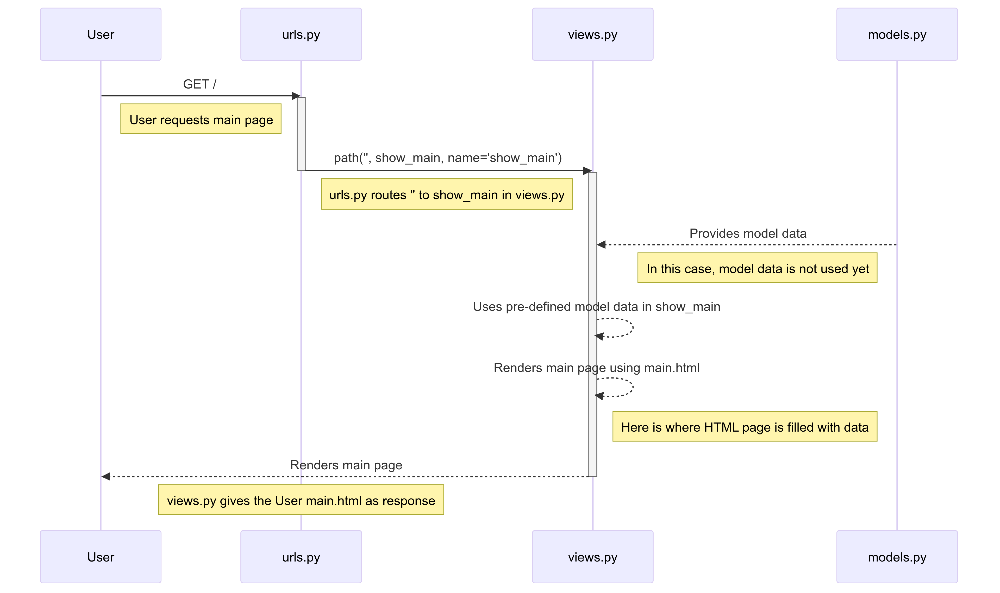

# KickStash

-   [URLs](#URLs)
-   [Pertanyaan dan Jawaban](#Pertanyaan-dan-Jawaban)
    -  [Tugas 3](#Tugas-3)
    -  [Tugas 2](#Tugas-2)
-   [Checklist Tugas](#Checklist-Tugas)
    -  [Tugas 3](#Tugas-3)
    -  [Tugas 2](#Tugas-2)

## URLs

URL (deployed via PWS):  
http://daffa-abhipraya-kickstash.pbp.cs.ui.ac.id/

## Pertanyaan dan Jawaban

### Tugas 3

XXX

### Tugas 2

1. Jelaskan bagaimana cara kamu mengimplementasikan _checklist_ di atas secara _step-by-step_ (bukan hanya sekadar mengikuti tutorial).

    **_Jawab_**:

    a. Pertama, saya membuat proyek Django baru dengan perintah `django-admin startproject kickstash .`. Kemudian, saya melakukan _routing_ pada proyek tersebut agar dapat menjalankan aplikasi `main` dengan menambahkan path `/` ke `urls.py` proyek.

    ```python
    from django.urls import path
    from main import views

    urlpatterns = [
    	path('', views.show_main, name='show_main'),
    ]
    ```

    b. Selanjutnya, saya membuat aplikasi baru dengan perintah `python3 manage.py startapp main`.

    c. Kemudian, saya membuat model `Product` di `models.py` dengan atribut `name`, `price`, dan `description`.

    ```python
    from django.db import models

    class Product(models.Model):
    	name = models.CharField(max_length=100)
    	price = models.DecimalField(max_digits=10, decimal_places=2)
    	description = models.TextField()
    ```

    Untuk sekarang, model ini belum mulai digunakan.

    d. Setelah itu, saya menyiapkan `main.html` sederhana di dalam direktori `templates` aplikasi `main` yang akan menampilkan data dari model `Product`.

    e. Setelah HTML utama selesai, saya membuat fungsi `show_main` di `views.py` yang akan mengembalikan _response_ berupa _template_ HTML yang menampilkan nama aplikasi dan nama serta kelas saya.

    ```python
    from django.shortcuts import render
    from .models import Product

    def show_main(request):
    	# Prepare pre-made context
    	context = {
    		'name': 'Birkenstock Boston',
    		'price': 2599000,
    		'description': 'Birkenstock Boston adalah sandal yang nyaman digunakan untuk berbagai aktivitas.'
    	}

    	return render(request, 'main.html', context)
    ```

    f. Selanjutnya, saya membuat _routing_ pada `urls.py` aplikasi `main` untuk membuat _path_ yang memetakan fungsi yang telah dibuat pada `views.py`.

    ```python
    from django.contrib import admin
    from django.urls import path, include

    urlpatterns = [
    	path('admin/', admin.site.urls),
    	path('', include('main.urls')),
    ]
    ```

    g. Terakhir, saya melakukan _deployment_ ke PWS terhadap aplikasi yang sudah dibuat sehingga nantinya dapat diakses melalui Internet.

2. Buatlah bagan yang berisi _request client_ ke web aplikasi berbasis Django beserta responnya dan jelaskan pada bagan tersebut kaitan antara `urls.py`, `views.py`, `models.py`, dan berkas `html`.

    **_Jawab_**:

    

    Penjelasan:

    1. User mengakses aplikasi web melalui browser dengan mengirimkan _request_ ke URL utama (`/`).
    2. _Request_ tersebut diterima oleh `urls.py` yang mengarahkannya ke fungsi `show_main` di `views.py`. Path `/` ditulis dengan `''` di `urls.py`.
    3. Fungsi `show_main` di `views.py` sudah mempunyai pre-defined model data (context) di dalamnya, sehingga tinggal mengisinya ke `templates/main.html`.
    4. `main.html` akan di-_render_ oleh `views.py` dan dikirimkan sebagai _response_ ke _client_ (browser).

3. Jelaskan fungsi `git` dalam pengembangan perangkat lunak!

    **_Jawab_**:

    Beberapa fungsi `git` yang paling penting dalam pengembangan perangkat lunak adalah sebagai berikut.

    - **Version Control**:  
      Git mencatat setiap perubahan pada kode, memungkinkan developer untuk melihat riwayat pengeditan, siapa yang mengubah apa, dan kapan perubahan tersebut dilakukan.
    - **Collaboration**:  
      Git memfasilitasi kolaborasi tim dengan memungkinkan banyak developer bekerja pada proyek yang sama tanpa mengganggu pekerjaan satu sama lain. Ini dilakukan dengan menggunakan `branching` dan `merging`.
    - **Backup**:  
      Git memungkinkan developer untuk kembali ke versi sebelumnya dari kode jika terjadi kesalahan, dengan memanfaatkan fitur seperti `commit`, `reset`, dan `checkout`.
    - **Code Review**:  
      Git memungkinkan developer untuk melakukan _code review_ dengan mudah, memungkinkan mereka untuk memberikan masukan dan saran kepada rekan tim mereka.
    - **Deployment**:  
      Git memungkinkan developer untuk melakukan _deployment_ kode ke server produksi dengan mudah, dengan memanfaatkan fitur seperti `push` dan `pull`.

4. Menurut Anda, dari semua framework yang ada, mengapa framework Django dijadikan permulaan pembelajaran pengembangan perangkat lunak?

    **_Jawab_**:

    Ada beberapa alasan yang mungkin mendasarinya, di antaranya:

    - **Struktur**:  
      Django mengikuti pola MVT (Model-View-Template) yang membantu pemula memahami pentingnya arsitektur yang terstruktur dalam pengembangan aplikasi web.
    - **Fitur Bawaan**:  
      Django dilengkapi dengan banyak fitur bawaan, seperti autentikasi, pengelolaan database, dan manajemen admin, sehingga pemula dapat fokus pada belajar konsep dasar.
    - **Keamanan**:  
      Django memiliki mekanisme keamanan bawaan seperti perlindungan terhadap CSRF, SQL injection, dan XSS.
    - **Skalabilitas**:  
      Django dirancang untuk menangani aplikasi web yang kompleks dan besar, sehingga pemula dapat mempelajari cara mengelola aplikasi yang berkembang.
    - **ORM Bawaan**:  
      Django menyediakan _ORM_ bawaan yang memungkinkan developer untuk berinteraksi dengan database tanpa menulis SQL mentah.

5. Mengapa model pada Django disebut sebagai _ORM_?

    **_Jawab_**:

    Model pada Django disebut sebagai ORM (Object-Relational Mapping) karena mereka menghubungkan struktur objek dalam kode Python dengan tabel-tabel dalam database relasional. Dengan menggunakan model Django, developer dapat berinteraksi dengan database menggunakan objek Python, tanpa perlu menulis SQL mentah.

## Checklist Tugas

### Tugas 3

-   [x] Membuat input `form` untuk menambahkan objek model pada app sebelumnya.
-   [x] Tambahkan 4 fungsi `views` baru untuk melihat objek yang sudah ditambahkan dalam format XML, JSON, XML _by ID_, dan JSON _by ID_.
-   [x] Membuat routing URL untuk masing-masing `views` yang telah ditambahkan pada poin 2.
-   [ ] Menjawab beberapa pertanyaan berikut pada `README.md` pada _root folder_.
    -   [ ] Jelaskan mengapa kita memerlukan _data delivery_ dalam pengimplementasian sebuah platform?
    -   [ ] Menurutmu, mana yang lebih baik antara XML dan JSON? Mengapa JSON lebih populer dibandingkan XML?
    -   [ ] Jelaskan fungsi dari method `is_valid()` pada form Django dan mengapa kita membutuhkan method tersebut?
    -   [ ] Mengapa kita membutuhkan `csrf_token` saat membuat form di Django? Apa yang dapat terjadi jika kita tidak menambahkan `csrf_token` pada form Django? Bagaimana hal tersebut dapat dimanfaatkan oleh penyerang?
    -   [ ] Jelaskan bagaimana cara kamu mengimplementasikan _checklist_ di atas secara _step-by-step_ (bukan hanya sekadar mengikuti tutorial).
-   [x] Mengakses keempat URL di poin 2 menggunakan Postman, membuat _screenshot_ dari hasil akses URL pada Postman, dan menambahkannya ke dalam `README.md`.
-   [x] Melakukan `add`-`commit`-`push` ke GitHub.

### Tugas 2

-   [x] Membuat sebuah proyek Django baru.
-   [x] Membuat aplikasi dengan nama `main` pada proyek tersebut.
-   [x] Melakukan _routing_ pada proyek agar dapat menjalankan aplikasi `main`.
-   [x] Membuat model pada aplikasi `main` dengan nama `Product` dan memiliki atribut wajib sebagai berikut.
    -   `name`
    -   `price`
    -   `description`
-   [x] Membuat sebuah fungsi pada `views.py` untuk dikembalikan ke dalam sebuah _template_ HTML yang menampilkan nama aplikasi serta nama dan kelas kamu.
-   [x] Membuat sebuah _routing_ pada `urls.py` aplikasi `main` untuk memetakan fungsi yang telah dibuat pada `views.py`.
-   [x] Melakukan _deployment_ ke PWS terhadap aplikasi yang sudah dibuat sehingga nantinya dapat diakses oleh teman-temanmu melalui Internet.
-   [x] Membuat sebuah `README.md` yang berisi tautan menuju aplikasi PWS yang sudah di-_deploy_, serta jawaban dari beberapa pertanyaan berikut.
    -   Jelaskan bagaimana cara kamu mengimplementasikan _checklist_ di atas secara _step-by-step_ (bukan hanya sekadar mengikuti tutorial).
    -   Buatlah bagan yang berisi _request client_ ke web aplikasi berbasis Django beserta responnya dan jelaskan pada bagan tersebut kaitan antara `urls.py`, `views.py`, `models.py`, dan berkas `html`.
    -   Jelaskan fungsi `git` dalam pengembangan perangkat lunak!
    -   Menurut Anda, dari semua framework yang ada, mengapa framework Django dijadikan permulaan pembelajaran pengembangan perangkat lunak?
    -   Mengapa model pada Django disebut sebagai _ORM_?
