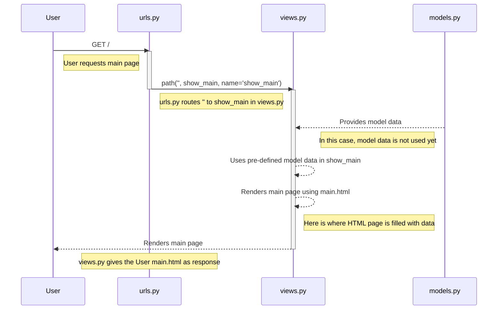

```mermaid

sequenceDiagram
    participant User
    participant urls.py
    participant views.py
    participant models.py

    User->>urls.py: GET /
    activate urls.py

    Note right of User: User requests main page

    urls.py->>views.py: path('', show_main, name='show_main')
    deactivate urls.py
    activate views.py

    Note right of urls.py: urls.py routes '' to show_main in views.py

    models.py-->>views.py: Provides model data

    Note left of models.py: In this case, model data is not used yet

    views.py-->>views.py: Uses pre-defined model data in show_main

    views.py-->>views.py: Renders main page using main.html

    Note right of views.py: Here is where HTML page is filled with data

    views.py-->>User: Renders main page
    deactivate views.py

    Note over urls.py: views.py gives the User main.html as response
```
